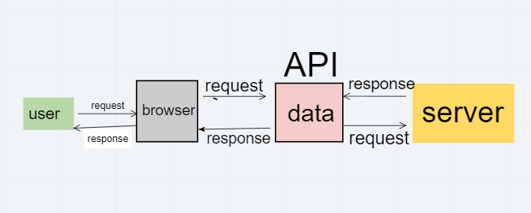
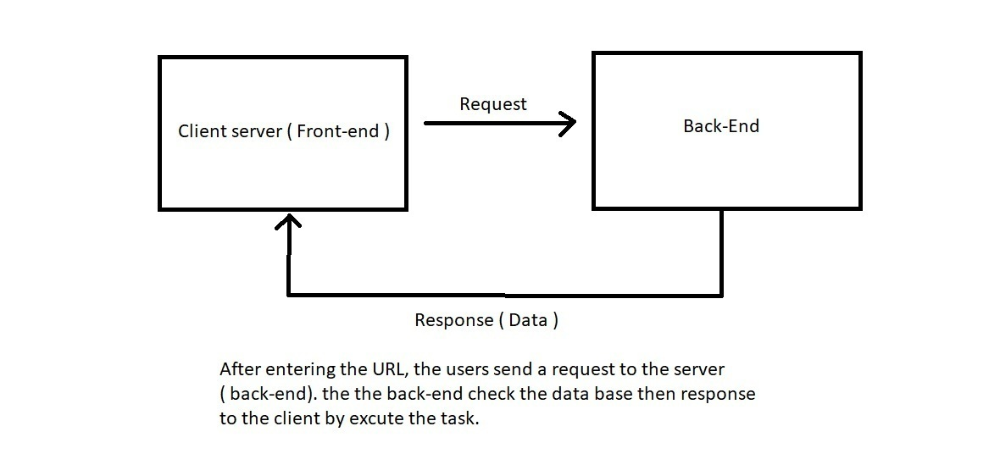

# repo-test

# city-explorer

**Author**: rula alqasem
**Version**: 1.0.0

## Overview

This Apllication is for exploring location that displys a map & weather & movie for the selected location by the user, The reason for building this application is to fill users need by exploring location around the world.

## Getting Started

The user can use my URL that deployed on Netlify in order to use this application easily.

## Architecture

I used API besides that I install thunder client extension in my VS code and I run this command (npm i react-Bootstrap Bootstrap axios) in order to use API effectivelly .

## Change Log

05-03-2021 9:59pm - Application now has a fully-functional express server, with a GET route for the location resource.

## Credit and Collaborations

1- [LocationIQ](https://locationiq.com/)
2- [React Bootstrap](https://react-bootstrap.github.io/)

## Name of feature: using API

Estimate of time needed to complete: 3 hours
Start time: 7 PM
Finish time: 10 PM
Actual time needed to complete: 3 hours

 

 Name of feature: _____________api___________________

Estimate of time needed to complete: __5h___

Start time: ___5pm__

Finish time: __10 pm___

Actual time needed to complete: ___4h__

Name of feature: _______________add MOVIe AND WEATHER api _________________

Estimate of time needed to complete: __9 h___

Start time: _2 pm___

Finish time: __11 pm___

Actual time needed to complete: __7h___
